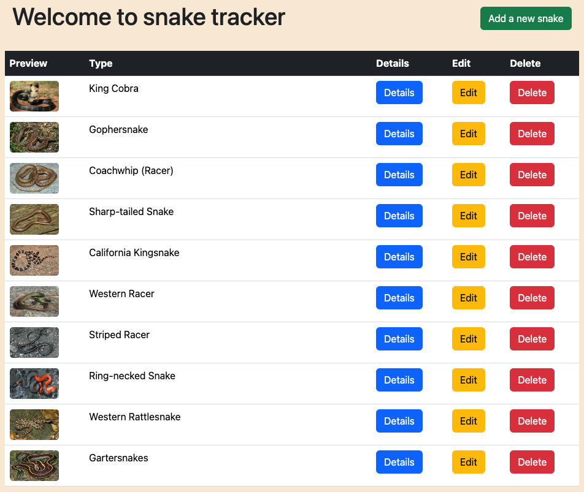
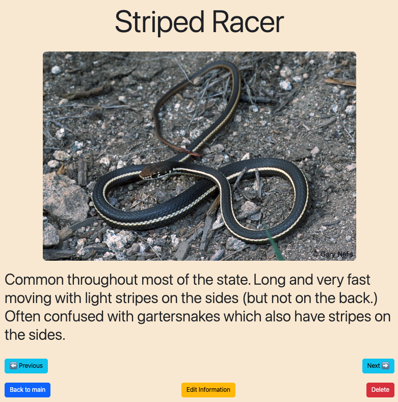
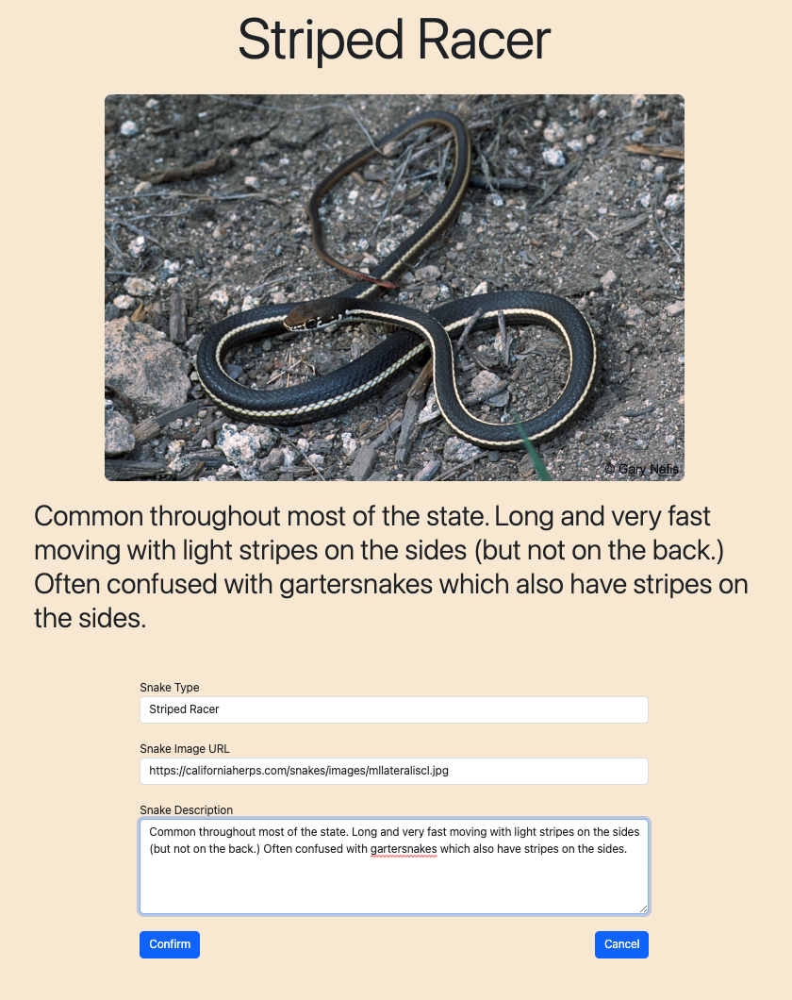

# JPACRUDProject

## Description

This event tracker is a full-stack app to track the snakes and reptiles that user encounter at San Diego zoo. Whenever I bring my kid to San Diego zoo, he spent a lot of time observing snakes, turtles, and reptiles. This snake database would be a good place to store and retrieve all the informaiton we get about the reptiles at San Diego Zoo. The database can be access using RESTful api with following end points

| HTTP Verb | URI                | Request Body                                     | Response Body                                  | Status Codes  |
| --------- | ------------------ | ------------------------------------------------ | ---------------------------------------------- | ------------- |
| GET       | `/api/snakes`      |                                                  | List all snakes and reptiles in the database   | 200           |
| GET       | `/api/snakes/{id}` |                                                  | JSON of snake/reptile with specific id         | 200, 404      |
| POST      | `/api/snakes`      | JSON of snake/reptile infornation                | JSON of added snake/reptile with associated id | 201, 400      |
| PUT       | `/api/snakes/{id}` | JSON of new version of snake/reptile information | JSON of updated snake/reptile information      | 200, 404, 400 |
| DELETE    | `/api/snakes/{id}` |                                                  |                                                | 204, 404, 400 |

THe front end is build using HTML, CSS, and Bootstrap. The application logic and REST database access are build using asynchronous Javascript. The app employ single-page approach where all the request/responses and user interaction happening on just a single page without reloading. The user can do full CRUD, including viewing all snakes in the database, updating and deleting snake entries, and creating new entries. At any point in the app, the user can navigate freely between different views on a same page without any hassle.

## Technology used

- HTML, CSS, Bootstrap, Javascript
- Java JPA/ JPA Repository
- Spring Boot
- Hibernate
- JUnit
- Gradle
- MySQL

## Lesson learned

- Creating RESTful API using Java Spring Boot.
- Single page application design using Javascript DOM manipulation.
- Front end RESTful API query using asynchronous Javascript XMLHttpRequest and Fetch API.
- Design reusable components with different functionality using Javascript only.
- Responsive design using Bootstrap.
